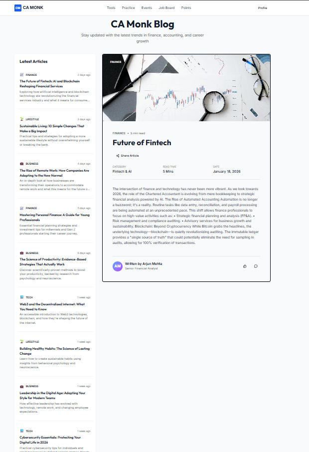
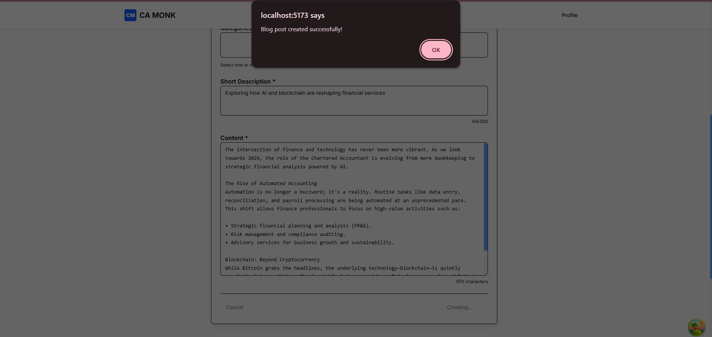
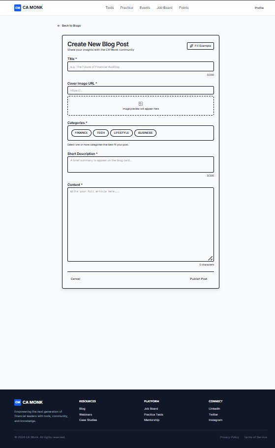

# CA Monk Blog Application

A modern, responsive blog application built with React, TypeScript, and Tailwind CSS. This project features a clean UI integrating `shadcn/ui` components for a professional look and feel.

## 🚀 Features

-   **Browse Blogs**: View a list of latest trends in finance, accounting, and career growth.
-   **Read Content**: Detailed blog view with rich content formatting.
-   **Create Posts**: Intuitive form to create new blog posts with category selection and preview.
-   **Search & Filter**: Real-time filtering by category and search terms (implemented in hooks).
-   **Responsive Design**: Fully responsive layout optimized for desktop, tablet, and mobile.
-   **Modern UI**: Utilizing `shadcn/ui` components for consistent and accessible design.

## 🛠️ Tech Stack

-   **Frontend**: React 19, TypeScript, Vite
-   **Styling**: Tailwind CSS v4, shadcn/ui
-   **State Management**: TanStack Query (React Query) v5
-   **Mock Backend**: JSON Server
-   **Icons**: Lucide React
-   **Utilities**: clsx, tailwind-merge

## 📸 Screenshots

### Home Page

*The landing page displaying the latest curated articles.*

### Blog Detail View

*Immersive reading experience for blog posts.*

### Create Blog Experience

*User-friendly form to publish new insights.*

## 🏃‍♂️ How to Run

1.  **Clone the repository**
    ```bash
    git clone https://github.com/priti200/Blog_Application.git
    cd Blog_Application
    ```

2.  **Install Dependencies**
    ```bash
    npm install
    ```

3.  **Start the Backend (mock)**
    The application uses `json-server` to mock a REST API.
    ```bash
    npm run server
    ```
    *Runs on http://localhost:3001*

4.  **Start the Frontend**
    In a new terminal:
    ```bash
    npm run dev
    ```
    *Runs on http://localhost:5173*

## � API Endpoints

The mock backend (JSON Server) provides the following RESTful endpoints:

| Method | Endpoint      | Description                          |
| :----- | :------------ | :----------------------------------- |
| `GET`  | `/blogs`      | Retrieve all blog posts              |
| `GET`  | `/blogs/:id`  | Retrieve a specific blog by unique ID|
| `POST` | `/blogs`      | Create a new blog post               |

The server runs on `http://localhost:3001`.

## �📁 Project Structure

```
src/
├── components/
│   ├── blog/          # Blog-specific components (Card, Form, Featured)
│   ├── layout/        # Layout components (Header, Sidebar)
│   └── ui/            # Reusable shadcn/ui components (Button, Input, etc.)
├── hooks/             # Custom React hooks (useBlogs, useCreateBlog)
├── lib/               # Utilities (cn, formatting)
├── types/             # TypeScript definitions
└── App.tsx            # Main application component
```

## 📝 License

© 2026 CA Monk. All rights reserved.
